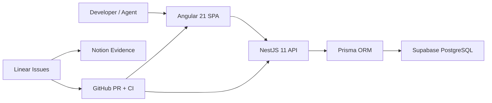

# Project Blueprint - ia-pm-development

> Version: 1.1 | Date: 2026-02-20 | Author: Architecture and Delivery Notes

---

## 1) Executive Summary

### What we are building, for whom, and why

**ia-pm-development** is a learning project that applies best practices and modern patterns to build a production-style Angular + NestJS solution with a workflow focused on AI-assisted implementation and PM management.

It is a personal update of a modern way of working and it is intentionally in continuous evolution. The primary value is the structure, architecture, and delivery model, not the specific product domain.

| Dimension | Value |
|---|---|
| Product focus | Learning platform for modern delivery practices |
| Primary users | Developers, AI agents, and PM workflows |
| Platforms | Web SPA + REST API |
| Core stack | Angular 21 + NestJS 11 + Prisma 7 + Supabase PostgreSQL |
| Hosting | GitHub Pages (web) + Render (API) |
| Project operations | Linear (planning) + Notion (evidence) + GitHub (code/CI) |

### System map



### Guiding principles

1. Issue-first: no implementation without a refined issue.
2. 1 issue = 1 branch = 1 PR.
3. Agent-first delivery with explicit `agent:*` ownership.
4. Feature-first architecture with clear layers.
5. Signals-first state in Angular (`@ngrx/signals`).
6. CI is the gatekeeper: lint, test, build, e2e, governance.
7. Documentation as code: ADRs, runbooks, and playbooks in-repo.
8. Progressive complexity: start simple, scale architecture only when needed.

---

## 2) Architecture

### Architectural style

A **modular monolith** in a `pnpm` monorepo.

- Frontend: feature-first + layered architecture.
- Backend: NestJS modules (controller -> service -> repository).
- Shared: cross-app types and contracts.

### Bounded contexts

| Module | Responsibility |
|---|---|
| `apps/web/src/app/features/auth` | Auth UI flows, route protection, token UX |
| `apps/web/src/app/features/products` | Product CRUD UI, filters, forms, tables |
| `apps/api/src/auth` | Auth endpoints, guards, JWT strategy |
| `apps/api/src/products` | Product CRUD API, DTO validation, repository access |
| `apps/api/src/health` | Liveness/readiness probes |
| `apps/api/src/integrations/prisma` | Prisma client lifecycle and DB connectivity |
| `apps/api/src/integrations/supabase` | Supabase integration fallback and transition support |
| `libs/shared` | Shared DTOs/types between web and API |

### Layering conventions

Frontend:

```text
features/<feature>/
  domain/
  data-access/
  state/
  ui/
```

Dependency direction:

```text
ui -> state -> data-access -> core
```

Backend:

```text
src/<module>/
  *.controller.ts
  *.service.ts
  *.repository.ts
  dto/
  guards/
  strategies/
  decorators/
```

---

## 3) Technology Decisions

| Decision area | Choice | Reason |
|---|---|---|
| Monorepo | `pnpm workspaces` | Low overhead, fast onboarding |
| Frontend | Angular 21 | Strong structure, standalone APIs, signals-ready |
| Backend | NestJS 11 | Module system, DI, guards, testing conventions |
| State management | `@ngrx/signals` | Lightweight reactive state aligned with Angular signals |
| ORM | Prisma 7 | Type-safe schema and migration workflow |
| Database | Supabase PostgreSQL | Managed Postgres + practical free tier |
| API docs | `@nestjs/swagger` | Contract generation from decorators |
| Unit tests (API) | Jest | Native NestJS testing defaults |
| Unit tests (Web) | Vitest + Angular test tooling | Fast test feedback |
| E2E | Playwright | Browser-level confidence in CI |
| CI/CD | GitHub Actions | Native workflow integration |
| Deployment | GitHub Pages + Render | Simple, low-cost deployment model |

### MCP servers in use (Codex)

| Type | Server | Status |
|---|---|---|
| Custom | `angular-cli` | Active |
| Custom | `context7` | Active |
| Custom | `github` | Active |
| Custom | `postman` | Active |
| Custom | `supabase` | Active |
| Custom | `testsprite` | Active |
| Recommended | `Linear` | Active |
| Recommended | `Notion` | Active |
| Recommended | `Figma` | Active |
| Recommended | `Playwright` | Active |

### Installed skills (Codex)

| Skill | Primary use |
|---|---|
| `Backend NestJS` | Deliver NestJS backend issues with tests and evidence |
| `Figma` | Pull design context through Figma MCP |
| `Figma Implement Design` | Implement designs with high-fidelity output |
| `Frontend Angular` | Deliver Angular features and UI state flows |
| `Linear` | Manage issue workflow and issue metadata |
| `Nestjs Best Practices` | Enforce robust NestJS architecture patterns |
| `Notion Spec to Implementation` | Turn Notion specs into implementation plans |
| `OpenAI Docs` | Use official OpenAI docs during implementation |
| `Playwright CLI Skill` | Browser automation for verification and E2E support |
| `PM Orchestrator` | Coordinate issue -> branch -> PR flow |
| `Prisma Expert` | Prisma schema, migrations, and query patterns |
| `QA Quality Gate` | Risk-based QA gating and evidence |
| `Release Operator` | CI/CD and release hardening |
| `Render Deploy` | Deployment setup and Render blueprint operations |
| `Skill Creator` | Create and evolve reusable skills |
| `Skill Installer` | Install and update skills |

---

## 4) Repository Structure

```text
ia-pm-development/
  apps/
    web/          # Angular app
    api/          # NestJS API
    web-e2e/      # Playwright E2E
  libs/
    shared/       # Shared types/contracts
  docs/
    ai/
    runbooks/
    adr/
    qa/
    prd/
  .github/
    workflows/
  AGENTS.md
  llms.txt
  pnpm-workspace.yaml
  render.yaml
```

---

## 5) Data Model and API Surface

### Core entities

`User`

- `id`
- `email`
- `passwordHash`
- `role`
- `createdAt`

`Product`

- `id`
- `name`
- `description`
- `sku`
- `price`
- `stock`
- `createdAt`
- `updatedAt`

### Main endpoints (v1)

| Method | Endpoint | Auth | Purpose |
|---|---|---|---|
| `POST` | `/v1/auth/register` | No | Create account |
| `POST` | `/v1/auth/token` | No | Login and return JWT |
| `GET` | `/v1/products` | JWT | List products |
| `GET` | `/v1/products/:id` | JWT | Product detail |
| `POST` | `/v1/products` | JWT | Create product |
| `PATCH` | `/v1/products/:id` | JWT | Update product |
| `DELETE` | `/v1/products/:id` | JWT | Delete product |
| `GET` | `/v1/health/live` | No | Liveness check |
| `GET` | `/v1/health/ready` | No | Readiness check |

---

## 6) Security Baseline

| Layer | Mechanism |
|---|---|
| Authentication | JWT (`HS256`, shared secret) with `@nestjs/passport` |
| Password storage | `bcryptjs` hashing |
| Authorization | Role guards (`admin`, `user`) |
| API hardening | `helmet`, CORS via env, throttling |
| Secrets | Environment variables in hosting platform |

Required env examples:

- `AUTH_JWT_SECRET`
- `AUTH_JWT_EXPIRES_IN_SECONDS`
- `DATABASE_URL`
- `SUPABASE_SECRET_KEY`
- `APP_CORS_ORIGINS`

---

## 7) Delivery Workflow (Agent-First)

1. Create/refine one Linear issue.
2. Ensure exactly one `agent:*` label is present.
3. Create one branch for that issue.
4. Implement only issue scope.
5. Run validation locally:

```bash
pnpm lint
pnpm test
pnpm build
```

6. Open one PR with required body fields:

- `Linear: <TEAM-ISSUE>`
- `Notion: <url>`
- `Agent Owner: agent:<role>`

7. Pass governance + quality CI checks.
8. Merge to `main` through PR only.

---

## 8) Quality Gates

Mandatory gates:

- Governance checks (branch name, PR metadata, required docs links).
- Lint.
- Unit/integration tests.
- Build.
- Playwright web E2E.
- Aggregate `quality` check before merge.

---

## 9) Documentation Map

Canonical references:

- `docs/README.md`
- `docs/ai/agent-operating-model.md`
- `docs/runbooks/github-project-workflow.md`
- `docs/runbooks/git-branching-model.md`
- `docs/ai/angular-ai-professional-playbook.md`
- `docs/ai/checklists/ai-self-review-gate.md`

---

## 10) Quick Start

Prerequisites:

- Node.js 22+
- `pnpm` 10+

Install and run:

```bash
pnpm install
pnpm dev
```

Validation:

```bash
pnpm lint
pnpm test
pnpm build
```

---

## 11) Project Positioning

This repository is intentionally positioned as a **living blueprint** for modern engineering execution with AI support.

The most important outcomes are:

1. Repeatable architecture and delivery patterns.
2. Traceable PM workflow from issue to production.
3. Clear quality and documentation standards.

The business domain can evolve; the operating model and engineering discipline are the long-term asset.
