# Project Blueprint — ia-pm-development

> Version: 1.0 · Date: 2026-02-20 · Author: Ridel Hernández

---

## 1) Executive Summary

### What we are building, for whom, and why

**ia-pm-development** is a learning project that applies best practices and patterns to build a modern Angular + NestJS solution, with a workflow focused on AI-assisted implementation and PM management.

It is a personal update of a modern way of working and is in constant evolution. The main value is the structure and architecture, not the specific product being built.

| Dimension | Value |
|---|---|
| **Product** | Warehouse Product Manager — MVP |
| **Users** | Warehouse operators + administrators |
| **Platforms** | Web SPA + REST API |
| **Stack** | Angular 21 + NestJS 11 + Prisma 7 + Supabase PostgreSQL |
| **Deploy** | GitHub Pages (web) + Render (API) — $0 cost |
| **Management** | Linear (backlog) + Notion (docs) + GitHub (code/CI) |

### System Mind Map


### Guiding Principles

1. **Issue-first**: No refined issue, no development.
2. **1 issue = 1 branch = 1 PR**: Always narrowed scope.
3. **Agent-first delivery**: Explicit ownership by role (`agent:*`).
4. **Feature-first architecture**: Vertical modules with horizontal layers.
5. **Signals-first state**: `@ngrx/signals` as the Angular state standard.
6. **CI as guardian**: lint → test → build → e2e → mandatory governance checks before merge.
7. **Zero-cost hosting**: GitHub Pages + Render Free Tier.
8. **Conventional quality gates**: self-review checklist, PR template, and evidence in every delivery.
9. **Documentation as code**: Versioned ADRs, runbooks, and playbooks in the repo.
10. **Progressive complexity**: Start simple (pnpm workspaces), scale when the project demands it.

---

## 2) Architecture

### Architectural Style

**Modular Monolith** with clear frontend/backend separation in a monorepo managed by `pnpm workspaces`.

- **Frontend** → Feature-first + Layered Architecture (inspired by DDD-lite)
- **Backend** → NestJS Module Architecture (Controller → Service → Repository)
- **Shared** → Cross-app types and utilities library

### Bounded Contexts / Modules


| Module | Responsibility |
|---|---|
| `features/auth` | Login, registration, JWT token flow, route guards |
| `features/products` | Product CRUD, listing, search, detail, form |
| `auth/` (API) | Registration, login, JWT strategy, guards, roles |
| `products/` (API) | Controller, service, repository, DTOs, validation |
| `health/` (API) | Liveness + readiness endpoints |
| `integrations/prisma` | PrismaService, client lifecycle |
| `integrations/supabase` | SupabaseService (legacy, migration in progress) |
| `common/` (API) | Global filters, interceptors |
| [config/](file:///c:/Hall/Work/learn/ia-pm-development/.editorconfig) (API) | Centralized configuration module |
| `libs/shared` | Shared types between web and api |

### Layer Separation (Frontend)

```text
apps/web/src/app/features/<feature>/
  domain/          ← DTOs, models, mappers (side-effect free)
  data-access/     ← API clients, adapters
  state/           ← @ngrx/signals stores
  ui/              ← Pages (containers) + Components (presentational)
```

**Dependency Direction:** `ui → state → data-access → core`

### Layer Separation (Backend)

```text
apps/api/src/<module>/
  *.controller.ts    ← HTTP handling, validation
  *.service.ts       ← Business logic
  *.repository.ts    ← Data access (Prisma)
  dto/               ← Request/Response DTOs
  guards/            ← Auth guards
  strategies/        ← Passport strategies
  decorators/        ← Custom decorators
```

### Key Patterns and When NOT to Use Them

| Pattern | When to use it | When NOT to use it |
|---|---|---|
| Signal Stores (`@ngrx/signals`) | All Angular feature state | Not for ephemeral component state (use local `signal()`) |
| Repository Pattern | Data access in API | Not for complex business logic (use Service) |
| DTOs + class-validator | All API input | Not for internal domain objects |
| Feature-first folders | Every Angular functionality | Not for cross-feature utilities (use `core/` or `shared/`) |
| Guards + Decorators | Endpoint protection | Not for business logic in controllers |
| rxMethod | Asynchronous side-effects in stores | Not for synchronous transformations (use `withComputed`) |

---

## 3) Technologies and Decisions (ADR)

| # | Decision | Alternatives | Chosen | Why | Risks | Mitigation |
|---|---|---|---|---|---|---|
| 1 | **Monorepo** | pnpm workspaces / Nx / Turborepo | pnpm workspaces | Minimum initial complexity, fast onboarding | Scale: possible overhead without task graph | Migrate to Nx/Turbo if it grows to >5 apps/libs |
| 2 | **Frontend** | Angular 21 / React / Vue | Angular 21 | Standalone components, signals-first, enterprise-ready | Learning curve | Playbook + AI prompts + MCP |
| 3 | **Backend** | NestJS 11 / Fastify / Express | NestJS 11 | Modules, DI, guards, Swagger, Jest integrated | Boilerplate | Templates + generators |
| 4 | **State** | @ngrx/signals / NgRx Store / Akita | @ngrx/signals | Lightweight, signals-native, one store per feature | API may change between versions | Anchored to v21 |
| 5 | **ORM** | Prisma 7 / TypeORM / Drizzle | Prisma 7 | Type-safe, migrations, schema-first | Cold start in serverless | N/A (Node service) |
| 6 | **DB** | Supabase PG / PlanetScale / Neon | Supabase PostgreSQL | Generous free tier, RLS, dashboard, future Auth | Slight vendor lock-in | Prisma abstracts access |
| 7 | **Auth** | JWT + Passport / Supabase Auth / Auth0 | JWT + Passport (custom) | Full control, no external dependency | Implement manual rotation | `TODO:` JWT secret rotation |
| 8 | **Web Hosting** | GitHub Pages / Vercel / Netlify | GitHub Pages | Free, repo integrated, SPA support with 404.html | No SSR | Pure SPA is enough for MVP |
| 9 | **API Hosting** | Render / Railway / Fly.io | Render (free) | Blueprint IaC, health checks, Node native | Cold start on free plan | Health check + Supabase persistent |
| 10 | **CI/CD** | GitHub Actions / GitLab CI / CircleCI | GitHub Actions | Native to repo, YAML, free minutes | 2000 min/month free | Parallel jobs, pnpm cache |
| 11 | **E2E** | Playwright / Cypress / TestCafe | Playwright | Multi-browser, fast, TypeScript-native | Browser setup in CI | `playwright install chromium` in CI |
| 12 | **Web Unit test** | Vitest / Jest / Karma | Vitest 4 | Fast, ESM-native, Angular compatible | Less Angular documentation | Full migration to Vitest |
| 13 | **API Unit test** | Jest 30 / Vitest | Jest 30 | NestJS default, integrated setup | Slow in large monorepo | `--maxWorkers=50%` |
| 14 | **Management** | Linear + Notion / GitHub Projects / Jira | Linear + Notion | Fast backlog + living docs | Two tools | Strict link convention |
| 15 | **UI Library** | Angular Material / PrimeNG / TailwindUI | Angular Material 21 | Powerful CDK, signals-ready, official standard | Opinionated style | Customization via theming |
| 16 | **Charts** | Chart.js / D3 / ngx-charts | Chart.js 4 | Lightweight, simple API, canvas-based | Not signal reactive | Wrapper component |
| 17 | **API Docs** | Swagger/OpenAPI / GraphQL | @nestjs/swagger | Auto-generated from decorators | Keeping decorators updated | Validate in review |
| 18 | **Lint/Format** | ESLint 9 + Prettier | ESLint 9 flat + Prettier 3 | Modern standard, flat config | Legacy plugins migration | Already migrated |

### MCP servers used

| Type | Server | Status |
|---|---|---|
| Custom | `angular-cli` | Enabled |
| Custom | `context7` | Enabled |
| Custom | `github` | Enabled |
| Custom | `postman` | Enabled |
| Custom | `supabase` | Enabled |
| Custom | `testsprite` | Enabled |
| Recommended | `Linear` | Enabled |
| Recommended | `Notion` | Enabled |
| Recommended | `Figma` | Enabled |
| Recommended | `Playwright` | Enabled |

### Installed skills used

| Skill | Purpose |
|---|---|
| `Backend NestJS` | Deliver NestJS backend issues with tests and API evidence |
| `Figma` | Use Figma MCP context for design-to-code tasks |
| `Figma Implement Design` | Translate Figma designs into production-ready implementation |
| `Frontend Angular` | Deliver Angular issues with robust UI state and integration |
| `Linear` | Manage Linear issue workflow in Codex |
| `Nestjs Best Practices` | Apply NestJS architecture and implementation best practices |
| `Notion Spec to Implementation` | Convert Notion specs into implementation plans |
| `OpenAI Docs` | Reference official OpenAI developer documentation |
| `Playwright CLI Skill` | Automate browser workflows from the terminal |
| `PM Orchestrator` | Orchestrate issue-to-PR delivery flow |
| `Prisma Expert` | Handle Prisma schema, migrations, and data modeling |
| `QA Quality Gate` | Validate quality gates with risk-based checks |
| `Release Operator` | Operate CI/CD and release hardening workflows |
| `Render Deploy` | Deploy applications to Render with blueprints |
| `Skill Creator` | Create and update skills |
| `Skill Installer` | Install curated or external skills |

---

## 4) Repo Structure

### Current and Replicable Tree

```text
ia-pm-development/
├── .cursor/rules/              # Cursor AI rules
├── .editorconfig               # Editor formatting
├── .gitattributes              # Line-ending normalization
├── .github/
│   ├── ISSUE_TEMPLATE/         # 5 types of issues + config.yml
│   ├── copilot-instructions.md # GitHub Copilot context
│   ├── pull_request_template.md# PR template with self-review gate
│   └── workflows/
│       ├── ci.yml              # Governance + Lint + Test + Build + E2E + Quality
│       └── deploy-web-pages.yml# Deploy Angular to GitHub Pages
├── .gitignore
├── .instructions.md            # VS Code / Copilot project-level
├── .vscode/                    # Editor settings
├── AGENTS.md                   # Global AI agent instructions
├── apps/
│   ├── api/                    # NestJS 11 backend
│   │   ├── .env.example        # Env template
│   │   ├── .prettierrc
│   │   ├── eslint.config.mjs
│   │   ├── nest-cli.json
│   │   ├── prisma/
│   │   │   └── schema.prisma   # Prisma schema (User, Product)
│   │   ├── prisma.config.ts    # Prisma config
│   │   ├── src/
│   │   │   ├── auth/           # AuthN/AuthZ module
│   │   │   ├── bootstrap/      # App bootstrap logic
│   │   │   ├── common/         # Filters, interceptors
│   │   │   ├── config/         # Configuration module
│   │   │   ├── health/         # Health check endpoints
│   │   │   ├── integrations/   # Prisma + Supabase services
│   │   │   ├── products/       # Products CRUD module
│   │   │   ├── app.module.ts
│   │   │   └── main.ts
│   │   ├── test/               # E2E tests (API)
│   │   ├── tsconfig.json
│   │   └── package.json
│   ├── web/                    # Angular 21 frontend
│   │   ├── angular.json
│   │   ├── eslint.config.js
│   │   ├── src/
│   │   │   └── app/
│   │   │       ├── core/       # Guards, config, HTTP interceptors
│   │   │       ├── shared/     # Shared UI components
│   │   │       ├── features/
│   │   │       │   ├── auth/   # Login, guards, token service
│   │   │       │   └── products/ # domain/ + data-access/ + state/ + ui/
│   │   │       ├── app.config.ts
│   │   │       └── app.routes.ts
│   │   ├── tsconfig.json
│   │   └── package.json
│   └── web-e2e/                # Playwright browser E2E
│       ├── playwright.config.ts
│       └── tests/
├── automation/n8n/             # n8n automation workflows
├── db/migrations/              # SQL migration scripts (Supabase)
├── docs/                       # Professional documentation
│   ├── README.md               # Documentation map
│   ├── _templates/             # ADR, PRD, QA, RFC, Runbook templates
│   ├── adr/                    # Architecture Decision Records
│   ├── ai/                     # AI operating model, playbook, prompts, workflows
│   ├── arch/                   # System architecture diagrams
│   ├── postman/                # API collection + environment
│   ├── prd/                    # Product Requirements Documents
│   ├── qa/                     # QA standards + reports
│   └── runbooks/               # Operational runbooks
├── libs/
│   └── shared/                 # @ia-pm/shared types lib
├── llms.txt                    # LLM context index
├── package.json                # Root workspace config
├── pnpm-workspace.yaml         # Workspace definition
└── render.yaml                 # Render IaC Blueprint
```

### Naming Conventions

| Element | Convention | Example |
|---|---|---|
| Feature folder | `kebab-case`, singular | `products`, `auth` |
| Component | `kebab-case.component.ts` | `product-list.component.ts` |
| Service | `kebab-case.service.ts` | `products-api.service.ts` |
| Store | `kebab-case.store.ts` | `products.store.ts` |
| DTO | `kebab-case.dto.ts` | `create-product.dto.ts` |
| Model | `kebab-case.model.ts` | `product.model.ts` |
| Guard | `kebab-case.guard.ts` | `auth.guard.ts` |
| Branch | `type/slug` | `feature/product-crud` |
| Commit | Conventional Commits | `feat(api): add product deletion` |
| ADR | `NNNN-slug.md` | `0005-add-caching.md` |

### Standard Scripts

```jsonc
// Root package.json
{
  "scripts": {
    "dev:web": "pnpm --filter web start",         // Angular dev server :4200
    "dev:api": "pnpm --filter api start:dev",      // NestJS watch mode :3000
    "lint": "pnpm -r --if-present lint",           // Lint all workspaces
    "test": "pnpm -r --if-present test",           // Test all workspaces
    "test:e2e:web": "playwright test --config apps/web-e2e/playwright.config.ts",
    "build": "pnpm -r --if-present build",         // Build all workspaces
    "format": "pnpm -r --if-present format"        // Format all workspaces
  }
}
```

---

## 5) Data Model and Contracts

### Current Entities (Prisma schema)

```prisma
model User {
  id           String   @id @db.Text
  username     String   @unique @db.Text
  passwordHash String   @map("passwordHash") @db.Text
  role         String   @db.Text
  createdAt    DateTime @default(now()) @map("createdAt") @db.Timestamptz(6)
  updatedAt    DateTime @default(now()) @map("updatedAt") @db.Timestamptz(6)

  @@index([role], map: "users_role_idx")
  @@map("users")
}

model Product {
  id             String   @id @db.Text
  sku            String   @unique @db.Text
  barcode        String?  @db.Text
  name           String   @db.Text
  category       String?  @db.Text
  brand          String?  @db.Text
  quantity       Int
  minimumStock   Int?     @map("minimumStock")
  unitPriceCents Int      @map("unitPriceCents")
  imageUrl       String?  @map("imageUrl") @db.Text
  status         String   @db.Text
  location       String?  @db.Text
  notes          String?  @db.Text
  createdAt      DateTime @default(now()) @map("createdAt") @db.Timestamptz(6)
  updatedAt      DateTime @default(now()) @map("updatedAt") @db.Timestamptz(6)

  @@index([status], map: "products_status_idx")
  @@index([name], map: "products_name_idx")
  @@index([category], map: "products_category_idx")
  @@index([brand], map: "products_brand_idx")
  @@map("products")
}
```

### DTOs and Validation

- **Input:** `class-validator` + `class-transformer` in NestJS DTOs (`dto/create-product.dto.ts`, `dto/update-product.dto.ts`).
- **Output:** Response DTOs mapped in the service layer.
- **Frontend:** Domain models separated from transport DTOs in `features/*/domain/`.
- **Rule:** UI consumes internal models, never transport DTOs directly.

### Target Endpoints (MVP)

| Method | Path | Auth | Description |
|---|---|---|---|
| `GET` | `/v1/health/live` | No | Liveness check |
| `GET` | `/v1/health/ready` | Admin | Readiness (Prisma + memory) |
| `POST` | `/v1/auth/register` | No | User registration |
| `POST` | `/v1/auth/token` | No | Login → JWT access token |
| `GET` | `/v1/products` | JWT | List products |
| `GET` | `/v1/products/:id` | JWT | Product detail |
| `POST` | `/v1/products` | JWT | Create product |
| `PATCH` | `/v1/products/:id` | JWT | Update product |
| `DELETE` | `/v1/products/:id` | JWT | Delete product |

**Swagger:** Enabled in dev (`APP_DOCS_ENABLED=true`) at `http://localhost:3000/docs`.

### Migration Strategy

1. **Prisma Migrate** for schema changes in development: `pnpm --filter api prisma:migrate:dev`.
2. **Deploy migrations** in CI/CD: `prisma migrate deploy`.
3. **Legacy SQL scripts** in `db/migrations/` for reference and direct execution in Supabase SQL Editor.
4. **Rollback:** use `git revert` of the PR + redeploy (do not rewrite history). Detail in `docs/runbooks/prisma-rollout-recovery.md`.

---

## 6) Security

### AuthN / AuthZ

| Layer | Mechanism |
|---|---|
| **Authentication** | JWT (RS256-compatible) via `@nestjs/passport` + `passport-jwt` |
| **Password Hashing** | `bcryptjs` |
| **Token config** | Expire: 900s (15 min), Issuer: `warehouse-api`, Audience: `warehouse-clients` |
| **Authorization** | Role-based guards (admin / user) |
| **Rate limiting** | `@nestjs/throttler` |
| **HTTP security headers** | `helmet` |
| **CORS** | Configured by env (`APP_CORS_ORIGINS`) |

### Secrets Management

| Variable | Environment | Management |
|---|---|---|
| `AUTH_JWT_SECRET` | Render env vars | ≥32 chars in production |
| `AUTH_PASSWORD_HASH` | Render env vars | Seed admin hash |
| `SUPABASE_SECRET_KEY` | Render env vars | Service role key from Supabase |
| `DATABASE_URL` | Render env vars | PostgreSQL connection string |

**Rules:**
- Never commit secrets in the repo.
- `.env`, `.env.local` in `.gitignore`.
- `.env.example` versioned as reference.
- `TODO:` Implement automatic rotation of `AUTH_JWT_SECRET`.
- `TODO:` Implement refresh tokens for longer sessions.

### Minimum Threat Model

| # | Risk | Impact | Current Control | Pending Mitigation |
|---|---|---|---|---|
| 1 | Weak/leaked JWT secret | Full access | Minimum 32 chars, env var | `TODO:` Periodic rotation |
| 2 | SQL injection | Data breach | Prisma parameterized queries | ✅ Covered |
| 3 | XSS | Session hijack | Angular native sanitization + Helmet | ✅ Covered |
| 4 | Brute force login | Account takeover | Throttler rate limiting | `TODO:` Account lockout policy |
| 5 | CORS misconfiguration | Cross-origin attacks | Explicit whitelist by env | ✅ Covered |
| 6 | Missing HTTPS | MITM | Render + GH Pages force HTTPS | ✅ Covered |
| 7 | Dependency vulns | Supply chain | Dependabot / `pnpm audit` | `TODO:` Automate `pnpm audit` in CI |

---

## 7) Professional Workflow (DevEx)

### Branching: GitHub Flow (pragmatic trunk-based)

| Rule | Detail |
|---|---|
| Stable branch | `main` (protected) |
| Everything branches from | Updated `main` |
| Convention | `feature/<slug>`, `fix/<slug>`, `chore/<slug>` |
| Max duration | < 2 days |
| Merge strategy | Squash merge + delete branch |
| Releases | Tags / SemVer, no long release branches |
| No direct push to main | Requires PR + CI |

### PR Template (already implemented)

```markdown
Linear: IA-000
Agent Owner: agent:frontend
Notion: <notion-page-url>

## Linked Work Item
- [ ] PR description includes `Linear: <TEAM-ISSUE>`
- [ ] PR links exactly one Linear issue
- [ ] Linked Linear issue has exactly one `agent:*` label

## Scope
- [ ] This PR implements only the issue scope and acceptance criteria
- [ ] Issue status moved to `In Review` in Linear
- [ ] Notion documentation link added to the Linear issue

## Changes
-

## Validation
- [ ] `pnpm lint`
- [ ] `pnpm test`
- [ ] `pnpm build`

## AI Self-Review Gate
### Framework reviewed
- [ ] Angular way
- [ ] NestJS way

### Checklist
- [ ] I reviewed `docs/ai/checklists/ai-self-review-gate.md`
- [ ] Solution follows framework patterns and project rules

### Decision
Decision: `Compliant | Needs Changes`

### Notes
-

## Risks / Notes
-
```

### Code Review Rules

1. Scope limited to the issue's acceptance criteria.
2. CI must pass (all 6 jobs: governance, lint, test, build, e2e-web, quality).
3. Self-review gate completed and decision = `Compliant`.
4. Notion evidence linked.
5. No features without a prior issue.

### Commits: Conventional Commits

```
<type>(<scope>): <subject>

type:  feat | fix | chore | docs | test | refactor | style | ci
scope: api | web | shared | ci | docs | e2e
```

Examples:
- `feat(api): add product delete endpoint`
- `fix(web): resolve signal unwrap in product list`
- `chore(ci): add pnpm cache to workflow`

### Release Strategy

- **Versioning:** Manual SemVer (root `package.json` v0.1.0).
- **Tags:** `v<major>.<minor>.<patch>` in `main` post-merge.
- **Changelog:** `TODO:` Implement automatic generation with `conventional-changelog`.
- **Web deploy:** Automatic on push to `main` with changes in `apps/web/**`.
- **API deploy:** Automatic via Render upon detecting push in `main`.

### Task Management



```mermaid
flowchart LR
  A["📋 Linear Issue<br>Todo"] --> B["🔧 In Progress<br>Branch created"]
  B --> C["📝 Notion Doc<br>Evidence + Decisions"]
  C --> D["✅ Local validation<br>lint + test + build"]
  D --> E["🔍 Self-Review Gate"]
  E --> F["🔀 PR opened<br>In Review"]
  F --> G["🤖 CI Pipeline<br>6 jobs"]
  G --> H["✔️ Merge to main<br>Done"]
```

**Linear team:** `Ia-integration`
**Statuses:** `Todo` → `In Progress` → `In Review` → `Done`
**Labels:** `type:*`, `priority:*`, `agent:*` (exactly one per issue)

---

## 8) CI/CD (replicable template)

### Ideal Pipeline (already implemented)


### Job: Governance (mandatory gate)

Validates before any technical check:
1. ✅ Branch naming `feature/*`, `fix/*`, `chore/*`
2. ✅ PR body has `Linear: <TEAM-ISSUE>` (exactly 1)
3. ✅ PR body has `Agent Owner: agent:<role>` (1 of 5 allowed)
4. ✅ PR body has `Notion: <url>`
5. ✅ PR body has `AI Self-Review Gate` section with framework and decision
6. ✅ Feature-first layer structure exists (domain, data-access, state, ui)
7. ✅ Required AI context files exist (AGENTS.md, llms.txt, etc.)
8. ✅ AGENTS.md references canonical docs

### CI Workflow (`ci.yml`) — pseudo-real

```yaml
name: CI
on:
  pull_request:
    branches: [main]
  push:
    branches: [main]

jobs:
  governance:
    name: Governance Checks
    runs-on: ubuntu-latest
    steps:
      - uses: actions/checkout@v4
      - name: Validate branch naming
        run: # regex check for feature/|fix/|chore/
      - name: Validate Linear + Agent Owner + Notion + Self-Review
        uses: actions/github-script@v7
        with:
          script: # PR body parsing and enforcement
      - name: Validate Angular feature-first layers
        run: # check domain/data-access/state/ui in each feature
      - name: Validate AI context files
        run: # existence check for required files

  lint:
    needs: governance
    steps:
      - uses: actions/checkout@v4
      - uses: pnpm/action-setup@v4
      - uses: actions/setup-node@v4
        with: { node-version: 22, cache: pnpm }
      - run: pnpm install --frozen-lockfile
      - run: pnpm lint

  test:
    needs: governance
    steps: # same setup + pnpm test

  build:
    needs: governance
    steps: # same setup + pnpm build

  e2e-web:
    needs: governance
    steps:
      - # same setup
      - run: pnpm exec playwright install --with-deps chromium
      - run: pnpm test:e2e:web

  quality:
    if: always()
    needs: [governance, lint, test, build, e2e-web]
    steps:
      - name: Enforce all jobs passed
        run: # check all results == success
```

### Environments and Deploy

| Environment | Web | API | Trigger |
|---|---|---|---|
| **dev** | `localhost:4200` | `localhost:3000` | Manual local |
| **prod** | GitHub Pages | Render | Push to `main` |
| `TODO:` staging | — | — | Tag `rc-*` |

### Deploy Web: GitHub Pages (`deploy-web-pages.yml`)

- Trigger: push to `main` with changes in `apps/web/**`
- Creates `env.js` with configurable API base URL
- Generates `404.html` for SPA deep links
- Upload + deploy via GitHub Pages actions

### Deploy API: Render (`render.yaml`)

- Declarative Blueprint IaC
- Build: `pnpm install --frozen-lockfile --filter api... && pnpm --filter api build`
- Start: `node apps/api/dist/main.js`
- Health check: `/v1/health/live`

---

## 9) Quality: Testing + Lint + Architecture

### Testing Pyramid

```text
        ┌─────────────┐
        │   E2E Web   │  Playwright (critical user journeys)
        │  (browser)  │  Login, search, CRUD flows
        ├─────────────┤
        │ Integration │  API e2e tests (supertest)
        │   (API)     │  Endpoint contracts
        ├─────────────┤
        │    Unit     │  Jest (API) + Vitest (Web)
        │  (fast)     │  Services, stores, components
        └─────────────┘
```

### Target Coverage

| Layer | Target | Do not obsess over |
|---|---|---|
| Unit (API services) | >80% | Trivial getters/setters |
| Unit (Angular stores) | >70% | Static template bindings |
| Integration (API endpoints) | All endpoints | Pagination variations |
| E2E (critical paths) | Auth + CRUD | Styles, animations |

### Lint/Format Rules

| Tool | Config | Scope |
|---|---|---|
| ESLint 9 (flat config) | `apps/api/eslint.config.mjs`, `apps/web/eslint.config.js` | TypeScript + Angular/NestJS |
| Prettier 3 | `apps/api/.prettierrc`, `apps/web/package.json#prettier` | All TS/HTML/SCSS |
| EditorConfig | `.editorconfig` | UTF-8, 2-space, LF |
| Angular ESLint | `angular-eslint` package | Template + component rules |

### Architecture Boundaries (CI-enforced)

CI validates in the `governance` job:
1. ✅ Feature-first layer structure (`domain`, `data-access`, `state`, `ui`) per feature.
2. ✅ Required AI context files present.
3. ✅ AGENTS.md references canonical docs.

`TODO:` Add ESLint import boundaries (e.g., `eslint-plugin-boundaries`) for enforcement at compile time.

---

## 10) Observability

### Current Status

| Dimension | Implemented | Status |
|---|---|---|
| Health endpoints | `/v1/health/live` (public), `/v1/health/ready` (admin) | ✅ |
| Prisma readiness | Prisma health indicator | ✅ |
| Memory heap check | Memory heap health indicator | ✅ |
| Structured logs | `TODO:` NestJS logger with JSON format | Pending |
| Metrics | `TODO:` Response time, error rates | Pending |
| Traces | `TODO:` OpenTelemetry | Pending |

### Recommended Minimum Alerts

| Alert | Threshold | Action |
|---|---|---|
| `/v1/health/live` fails | 2 consecutive failures | Restart container |
| `/v1/health/ready` fails | Prisma or memory degraded | Investigate DB connection |
| API response time > 3s | p95 > 3000ms | Scale or optimize query |
| Error rate > 5% | 5% of requests in 5min window | Investigate + rollback if needed |
| Disk/memory usage > 85% | Render metrics | Scale or optimize |

### Recommended Base Dashboard

`TODO:` Implement dashboard with:
- Render metrics (built-in)
- Supabase dashboard (DB connections, queries)
- Custom: `@nestjs/terminus` health aggregation
- Future: Grafana Cloud free tier

---

## 11) "Golden Path" for Feature Creation

### Step-by-Step Process


### Example 1: New Endpoint (Backend)

```bash
# 1. Create issue in Linear: "BE-XX: Add /v1/products/report/low-stock"
# 2. Branch
git fetch origin && git switch main && git pull --ff-only
git switch -c feature/low-stock-report

# 3. Generate files (NestJS patterns)
# In apps/api/src/products/:
#   - Add method in products.service.ts
#   - Add endpoint in products.controller.ts
#   - Add DTO if necessary in dto/

# 4. Validate
cd apps/api && pnpm test && pnpm lint
cd ../.. && pnpm build

# 5. Commit
git add . && git commit -m "feat(api): add low-stock report endpoint"

# 6. Self-review + PR
git push -u origin feature/low-stock-report
# → Open PR with template, Linear: IA-XX, Agent Owner: agent:backend
```

### Example 2: New UI (Frontend)

```bash
# 1. Issue: "FE-XX: Product detail page"
git switch -c feature/product-detail

# 2. Create structure in apps/web/src/app/features/products/:
#   domain/   → product-detail.model.ts (if new model)
#   data-access/ → (already exists products-api.service.ts)
#   state/    → (add method in products.store.ts or create sub-store)
#   ui/       → product-detail.page.ts + product-detail-card.component.ts

# 3. Angular Rules:
#   - Page = container (injects store)
#   - Component = presentational (receives inputs, emits outputs)
#   - States: loading, error, empty, success
#   - Control flow: @if, @for, @switch

# 4. Validate + commit + PR (same flow)
```

### Example 3: DB Change / Migration

```bash
# 1. Issue: "BE-XX: Add supplier_id to products"
git switch -c feature/product-supplier

# 2. Modify schema
# In apps/api/prisma/schema.prisma:
#   model Product {
#     ...
#     supplierId String? @db.Text
#   }

# 3. Generate migration
cd apps/api
pnpm prisma:migrate:dev --name add-supplier-to-products

# 4. Update DTOs, service, repository
# 5. Tests + lint + build

# 6. Deploy: prisma migrate deploy executes in CI/CD
#    or manually in Supabase SQL Editor if using legacy scripts
```

---

## 12) Ready-to-Copy Templates

### `.editorconfig`

```ini
root = true

[*]
charset = utf-8
end_of_line = lf
insert_final_newline = true
indent_style = space
indent_size = 2
trim_trailing_whitespace = true

[*.md]
trim_trailing_whitespace = false
max_line_length = off
```

### Prettier config (API: `.prettierrc`)

```json
{
  "singleQuote": true,
  "trailingComma": "all"
}
```

### Prettier config (Web: in `package.json`)

```json
{
  "prettier": {
    "printWidth": 100,
    "singleQuote": true,
    "overrides": [
      { "files": "*.html", "options": { "parser": "angular" } }
    ]
  }
}
```

### `.env.example` (API)

```env
DATABASE_URL=
DATABASE_SCHEMA=public
SUPABASE_URL=
SUPABASE_SECRET_KEY=
SUPABASE_PRODUCTS_TABLE=products
SUPABASE_USERS_TABLE=users
APP_CORS_ORIGINS=http://localhost:4200
APP_CORS_CREDENTIALS=false
APP_DOCS_ENABLED=true
APP_DOCS_PATH=docs
AUTH_JWT_SECRET=
AUTH_JWT_EXPIRES_IN_SECONDS=900
AUTH_JWT_ISSUER=warehouse-api
AUTH_JWT_AUDIENCE=warehouse-clients
```

### PR Template (`.github/pull_request_template.md`)

> Included in full in section 7.

### Issue Templates (`.github/ISSUE_TEMPLATE/`)

| Template | Automatic Labels |
|---|---|
| `backend-task.yml` | `type:backend`, `agent:backend`, `priority:p2` |
| `frontend-task.yml` | `type:frontend`, `agent:frontend`, `priority:p2` |
| `pm-task.yml` | `type:docs`, `agent:pm`, `priority:p2` |
| `release-task.yml` | `type:devops`, `agent:release`, `priority:p2` |
| `testing-task.yml` | `type:test`, `agent:qa`, `priority:p2` |

Each template requires: **Objective**, **Scope**, **Acceptance Criteria**.

### `config.yml` (issue chooser)

```yaml
blank_issues_enabled: false
contact_links:
  - name: Use Linear for backlog
    url: https://linear.app/ia-integration
    about: Create and manage tasks in Linear.
```

### CODEOWNERS

`TODO:` Create `.github/CODEOWNERS`:

```
# Global
* @RidelHI

# Frontend
apps/web/ @RidelHI
docs/ai/angular-ai-professional-playbook.md @RidelHI

# Backend
apps/api/ @RidelHI
apps/api/prisma/ @RidelHI
```

### Definition of Done

| Role | Criterion |
|---|---|
| **agent:pm** | Bounded scope, measurable criteria, correct labels |
| **agent:backend** | Consistent API contract, handled errors, tests ✅ |
| **agent:frontend** | Loading/error/empty states, no coupling, tests ✅ |
| **agent:qa** | Test matrix covered, explicit risks, evidence |
| **agent:release** | CI ✅, successful deploy, documented smoke test |

### Release Checklist

1. [ ] `main` has all milestone PRs merged.
2. [ ] `pnpm lint` + `pnpm test` + `pnpm build` pass locally.
3. [ ] CI quality gate is green for the last commit on `main`.
4. [ ] Tag created: `git tag -a v<x.y.z> -m "Release v<x.y.z>"`.
5. [ ] API deployed on Render + smoke checks passed.
6. [ ] Web deployed on GitHub Pages + navigation verified.
7. [ ] Changelog updated (`TODO:` automate).
8. [ ] Linear issues of the milestone marked as `Done`.
9. [ ] Notion release page created with summary.

---

## 13) Suggested Roadmap

### 30 Days — Foundation

| Priority | Item | Type |
|---|---|---|
| P1 | `TODO:` Implement refresh tokens | Feature |
| P1 | `TODO:` Add `pnpm audit` to CI pipeline | Security |
| P1 | `TODO:` Add CODEOWNERS | DevEx |
| P2 | `TODO:` Structured logging (JSON format) | Observability |
| P2 | `TODO:` ESLint import boundaries | Architecture |
| P2 | Increase unit test coverage to 80% (API) | Quality |

### 60 Days — Polish

| Priority | Item | Type |
|---|---|---|
| P1 | `TODO:` Staging environment | Infrastructure |
| P1 | `TODO:` Conventional changelog automation | DevEx |
| P2 | `TODO:` JWT secret rotation mechanism | Security |
| P2 | `TODO:` Account lockout after N failures | Security |
| P2 | Metrics Dashboard (Render + Supabase) | Observability |
| P3 | `TODO:` Supabase Storage for images | Feature |

### 90 Days — Scale

| Priority | Item | Type |
|---|---|---|
| P1 | Category/brand management (CRUD) | Feature |
| P1 | Inventory movements (basic kardex) | Feature |
| P2 | OpenTelemetry traces | Observability |
| P2 | Evaluate migration to Nx/Turborepo | Architecture |
| P3 | Multi-warehouse support | Feature |
| P3 | Reporting module (low stock, trends) | Feature |

### Most Valuable Technical Debt

1. **Supabase legacy fallback** — Remove fallback code for legacy keys (`SUPABASE_SERVICE_ROLE_KEY`).
2. **In-memory fallback** — Remove in-memory repository fallback for production.
3. **Image storage** — Migrate from `data:image` in DB to Supabase Storage.
4. **Test coverage gaps** — Stores and services without complete coverage.
5. **Missing commitlint/husky** — No local enforcement of Conventional Commits. `TODO:` Add.

---

## Extra Output

### 1) Checklist to Clone this Project

1. [ ] Create repo on GitHub (public, default branch `main`).
2. [ ] `git clone <url> && cd <repo>`.
3. [ ] Verify Node ≥ 22: `node -v`.
4. [ ] Enable corepack: `corepack enable && corepack prepare pnpm@10.17.1 --activate`.
5. [ ] `pnpm install`.
6. [ ] Copy `apps/api/.env.example` → `apps/api/.env.local` and fill in values.
7. [ ] Create project in Supabase (free tier).
8. [ ] Obtain `SUPABASE_URL`, `SUPABASE_SECRET_KEY`, `DATABASE_URL` from Supabase Dashboard.
9. [ ] Execute SQL migrations in Supabase SQL Editor (files in `db/migrations/`).
10. [ ] `pnpm --filter api prisma:generate`.
11. [ ] `pnpm dev:api` → verify `http://localhost:3000/v1/health/live`.
12. [ ] `pnpm dev:web` → verify `http://localhost:4200`.
13. [ ] `pnpm lint` → all clear.
14. [ ] `pnpm test` → all green.
15. [ ] `pnpm build` → build successful.
16. [ ] Configure branch protection in GitHub (`main` protected, require `quality` check).
17. [ ] Configure merge settings: squash only, delete branch on merge.
18. [ ] Connect repo to Render → create Blueprint from `render.yaml`.
19. [ ] Configure env vars in Render (JWT secret, Supabase keys, CORS).
20. [ ] Verify API deploy in Render: `curl https://<service>.onrender.com/v1/health/live`.
21. [ ] Enable GitHub Pages (source: GitHub Actions).
22. [ ] Configure repo variable `WEB_API_BASE_URL` in GitHub.
23. [ ] Push change to `apps/web/` → verify deploy on GitHub Pages.
24. [ ] Create team in Linear (`Ia-integration`), define statuses and labels.
25. [ ] Create workspace in Notion for documentation pages.
26. [ ] Create first Linear issue, follow complete flow from `Todo` to `Done`.
27. [ ] Install Playwright browsers: `pnpm exec playwright install chromium`.
28. [ ] `pnpm test:e2e:web` → E2E green.
29. [ ] Verify that `AGENTS.md`, `llms.txt`, `.instructions.md` are up to date.
30. [ ] Read `docs/README.md` as the documentation map.

### 2) Quickstart (<10 minutes)

```bash
# 1. Requirements: Node 22+, Git
node -v   # must be >= 22

# 2. Clone and install
git clone https://github.com/RidelHI/ia-pm-development.git
cd ia-pm-development
corepack enable
corepack prepare pnpm@10.17.1 --activate
pnpm install

# 3. Configure API (copy and edit)
cp apps/api/.env.example apps/api/.env.local
# Edit apps/api/.env.local with your Supabase values

# 4. Generate Prisma client
pnpm --filter api prisma:generate

# 5. Start backend
pnpm dev:api
# → http://localhost:3000/v1/health/live
# → http://localhost:3000/docs (Swagger)

# 6. Start frontend (another terminal)
pnpm dev:web
# → http://localhost:4200

# 7. Validate quality
pnpm lint
pnpm test
pnpm build

# 8. E2E (optional)
pnpm exec playwright install chromium
pnpm test:e2e:web
```

### 3) TODO List (Detected Gaps)

| # | TODO | Section | Priority |
|---|---|---|---|
| 1 | Implement refresh tokens for long sessions | Security | P1 |
| 2 | Add `pnpm audit` to CI pipeline | Security / CI | P1 |
| 3 | Create `.github/CODEOWNERS` | DevEx | P1 |
| 4 | Implement structured logging (JSON) in API | Observability | P2 |
| 5 | Add ESLint import boundaries plugin | Architecture | P2 |
| 6 | Implement automatic JWT secret rotation | Security | P2 |
| 7 | Implement account lockout after N failed attempts | Security | P2 |
| 8 | Create staging environment (preview deploys) | CI/CD | P1 |
| 9 | Automate changelog with `conventional-changelog` | DevEx | P2 |
| 10 | Add `commitlint` + `husky` + `lint-staged` | DevEx | P2 |
| 11 | Migrate images from `data:image/...` in DB to Supabase Storage | Data | P2 |
| 12 | Remove Supabase legacy keys fallback | Debt | P2 |
| 13 | Remove repository in-memory fallback in production | Debt | P2 |
| 14 | Implement metrics and dashboard (Render + Supabase) | Observability | P2 |
| 15 | Implement OpenTelemetry tracing | Observability | P3 |
| 16 | Add contract tests (API ↔ Web) | Quality | P3 |
| 17 | Evaluate Nx/Turborepo migration if >5 apps/libs | Architecture | P3 |
| 18 | Add Dependabot config for security updates | Security | P1 |
| 19 | Implement `AUTH_USERNAME/AUTH_PASSWORD` seed script | DevEx | P2 |
| 20 | Document versioning strategy in new ADR | Docs | P2 |

---
