# Project Blueprint — ia-pm-development

> **Version:** 1.0 · **Date:** 2026-02-20 · **Author:** Ridel Hernández Architect assessment

---

## 1) Resumen ejecutivo

### Qué construimos, para quién y por qué

**ia-pm-development** es un sistema full-stack de gestión de inventario para pequeños almacenes que reemplaza hojas sueltas y chats con una aplicación web profesional con CRUD real de productos, autenticación JWT y trazabilidad completa.

| Dimensión | Valor |
|---|---|
| **Producto** | Warehouse Product Manager — MVP |
| **Usuarios** | Operadores de almacén + administradores |
| **Plataformas** | Web SPA + REST API |
| **Stack** | Angular 21 + NestJS 11 + Prisma 7 + Supabase PostgreSQL |
| **Deploy** | GitHub Pages (web) + Render (API) — costo $0 |
| **Gestión** | Linear (backlog) + Notion (docs) + GitHub (código/CI) |

### Mapa mental del sistema


### Principios guía

1. **Issue-first**: sin issue refinada, no hay desarrollo.
2. **1 issue = 1 branch = 1 PR**: scope acotado siempre.
3. **Agent-first delivery**: ownership explícito por rol (`agent:*`).
4. **Feature-first architecture**: módulos verticales con capas horizontales.
5. **Signals-first state**: `@ngrx/signals` como estándar de estado Angular.
6. **CI como guardian**: lint → test → build → e2e → governance checks obligatorios antes de merge.
7. **Zero-cost hosting**: GitHub Pages + Render Free Tier.
8. **Conventional quality gates**: self-review checklist, PR template, y evidence en cada entrega.
9. **Documentation as code**: ADRs, runbooks y playbooks versionados en el repo.
10. **Progressive complexity**: empezar simple (pnpm workspaces), escalar cuando lo requiera el proyecto.

---

## 2) Arquitectura

### Estilo arquitectónico

**Modular Monolith** con separación clara frontend/backend en un monorepo gestionado por `pnpm workspaces`.

- **Frontend** → Feature-first + Layered Architecture (inspirado en DDD-lite)
- **Backend** → NestJS Module Architecture (Controller → Service → Repository)
- **Shared** → Librería de tipos y utilidades cross-app

### Bounded contexts / módulos


| Módulo | Responsabilidad |
|---|---|
| `features/auth` | Login, registro, JWT token flow, guards de ruta |
| `features/products` | CRUD de productos, listado, búsqueda, detalle, formulario |
| `auth/` (API) | Registro, login, JWT strategy, guards, roles |
| `products/` (API) | Controller, service, repository, DTOs, validación |
| `health/` (API) | Liveness + readiness endpoints |
| `integrations/prisma` | PrismaService, client lifecycle |
| `integrations/supabase` | SupabaseService (legacy, migración en curso) |
| `common/` (API) | Filters, interceptors globales |
| `config/` (API) | Módulo de configuración centralizada |
| `libs/shared` | Tipos compartidos entre web y api |

### Separación de capas (Frontend)

```text
apps/web/src/app/features/<feature>/
  domain/          ← DTOs, models, mappers (side-effect free)
  data-access/     ← API clients, adapters
  state/           ← @ngrx/signals stores
  ui/              ← Pages (containers) + Components (presentational)
```

**Dirección de dependencia:** `ui → state → data-access → core`

### Separación de capas (Backend)

```text
apps/api/src/<module>/
  *.controller.ts    ← HTTP handling, validation
  *.service.ts       ← Business logic
  *.repository.ts    ← Data access (Prisma)
  dto/               ← Request/Response DTOs
  guards/            ← Auth guards
  strategies/        ← Passport strategies
  decorators/        ← Custom decorators
```

### Patrones clave y cuándo NO usarlos

| Patrón | Cuándo usarlo | Cuándo NO |
|---|---|---|
| Signal Stores (`@ngrx/signals`) | Todo estado de feature en Angular | No para estado efímero de componente (usar `signal()` local) |
| Repository Pattern | Acceso a datos en API | No para lógica de negocio compleja (usar Service) |
| DTOs + class-validator | Todo input de API | No para objetos internos del dominio |
| Feature-first folders | Cada funcionalidad Angular | No para utilidades cross-feature (usar `core/` o `shared/`) |
| Guards + Decorators | Protección de endpoints | No para lógica de negocio en controllers |
| rxMethod | Side-effects asíncronos en stores | No para transformaciones síncronas (usar `withComputed`) |

---

## 3) Tecnologías y decisiones (ADR)

| # | Decisión | Alternativas | Elegida | Por qué | Riesgos | Mitigación |
|---|---|---|---|---|---|---|
| 1 | **Monorepo** | pnpm workspaces / Nx / Turborepo | pnpm workspaces | Mínima complejidad, onboarding rápido | Escala: posible overhead sin task graph | Migrar a Nx/Turbo si crece a >5 apps/libs |
| 2 | **Frontend** | Angular 21 / React / Vue | Angular 21 | Standalone components, signals-first, enterprise-ready | Curva de aprendizaje | Playbook + AI prompts + MCP |
| 3 | **Backend** | NestJS 11 / Fastify / Express | NestJS 11 | Módulos, DI, guards, Swagger, Jest integrados | Boilerplate | Templates + generators |
| 4 | **State** | @ngrx/signals / NgRx Store / Akita | @ngrx/signals | Lightweight, signals-native, un store por feature | API puede cambiar entre versiones | Anclado a v21 |
| 5 | **ORM** | Prisma 7 / TypeORM / Drizzle | Prisma 7 | Type-safe, migrations, schema-first | Cold start en serverless | No aplica (Node service) |
| 6 | **DB** | Supabase PG / PlanetScale / Neon | Supabase PostgreSQL | Free tier generoso, RLS, dashboard, Auth future | Vendor lock-in leve | Prisma abstrae el acceso |
| 7 | **Auth** | JWT + Passport / Supabase Auth / Auth0 | JWT + Passport (custom) | Control total, sin dependencia externa | Implementar rotación manual | `TODO:` rotación de JWT secret |
| 8 | **Hosting Web** | GitHub Pages / Vercel / Netlify | GitHub Pages | Free, integrado a repo, SPA support con 404.html | No SSR | SPA puro es suficiente para MVP |
| 9 | **Hosting API** | Render / Railway / Fly.io | Render (free) | Blueprint IaC, health checks, Node native | Cold start plan free | Health check + Supabase persistent |
| 10 | **CI/CD** | GitHub Actions / GitLab CI / CircleCI | GitHub Actions | Nativo al repo, YAML, free minutes | 2000 min/mes free | Jobs paralelos, cache pnpm |
| 11 | **E2E** | Playwright / Cypress / TestCafe | Playwright | Multi-browser, fast, TypeScript-native | Setup de browsers en CI | `playwright install chromium` en CI |
| 12 | **Unit test Web** | Vitest / Jest / Karma | Vitest 4 | Fast, ESM-native, Angular compatible | Menos documentación Angular | Migración completa a Vitest |
| 13 | **Unit test API** | Jest 30 / Vitest | Jest 30 | NestJS default, setup integrado | Lento en monorepo grande | `--maxWorkers=50%` |
| 14 | **Gestión** | Linear + Notion / GitHub Projects / Jira | Linear + Notion | Backlog veloz + docs vivas | Dos herramientas | Convención estricta de links |
| 15 | **UI Library** | Angular Material / PrimeNG / TailwindUI | Angular Material 21 | CDK potente, signals-ready, estándar oficial | Estilo opinionado | Customización vía theming |
| 16 | **Charts** | Chart.js / D3 / ngx-charts | Chart.js 4 | Ligero, simple API, canvas-based | No reactivo a signals | Wrapper component |
| 17 | **Docs API** | Swagger/OpenAPI / GraphQL | @nestjs/swagger | Auto-generado desde decoradores | Mantener decoradores actualizados | Validar en review |
| 18 | **Lint/Format** | ESLint 9 + Prettier | ESLint 9 flat + Prettier 3 | Estándar moderno, flat config | Migración de plugins legacy | Ya migrado |

---

## 4) Estructura del repo

### Tree actual y replicable

```text
ia-pm-development/
├── .cursor/rules/              # Cursor AI rules
├── .editorconfig               # Editor formatting
├── .gitattributes              # Line-ending normalization
├── .github/
│   ├── ISSUE_TEMPLATE/         # 5 tipos de issue + config.yml
│   ├── copilot-instructions.md # GitHub Copilot context
│   ├── pull_request_template.md# PR template con self-review gate
│   └── workflows/
│       ├── ci.yml              # Governance + Lint + Test + Build + E2E + Quality
│       └── deploy-web-pages.yml# Deploy Angular a GitHub Pages
├── .gitignore
├── .instructions.md            # VS Code / Copilot project-level
├── .vscode/                    # Editor settings
├── AGENTS.md                   # Global AI agent instructions
├── apps/
│   ├── api/                    # NestJS 11 backend
│   │   ├── .env.example        # Env template
│   │   ├── .prettierrc
│   │   ├── eslint.config.mjs
│   │   ├── nest-cli.json
│   │   ├── prisma/
│   │   │   └── schema.prisma   # Prisma schema (User, Product)
│   │   ├── prisma.config.ts    # Prisma config
│   │   ├── src/
│   │   │   ├── auth/           # AuthN/AuthZ module
│   │   │   ├── bootstrap/      # App bootstrap logic
│   │   │   ├── common/         # Filters, interceptors
│   │   │   ├── config/         # Configuration module
│   │   │   ├── health/         # Health check endpoints
│   │   │   ├── integrations/   # Prisma + Supabase services
│   │   │   ├── products/       # Products CRUD module
│   │   │   ├── app.module.ts
│   │   │   └── main.ts
│   │   ├── test/               # E2E tests (API)
│   │   ├── tsconfig.json
│   │   └── package.json
│   ├── web/                    # Angular 21 frontend
│   │   ├── angular.json
│   │   ├── eslint.config.js
│   │   ├── src/
│   │   │   └── app/
│   │   │       ├── core/       # Guards, config, HTTP interceptors
│   │   │       ├── shared/     # Shared UI components
│   │   │       ├── features/
│   │   │       │   ├── auth/   # Login, guards, token service
│   │   │       │   └── products/ # domain/ + data-access/ + state/ + ui/
│   │   │       ├── app.config.ts
│   │   │       └── app.routes.ts
│   │   ├── tsconfig.json
│   │   └── package.json
│   └── web-e2e/                # Playwright browser E2E
│       ├── playwright.config.ts
│       └── tests/
├── automation/n8n/             # n8n automation workflows
├── db/migrations/              # SQL migration scripts (Supabase)
├── docs/                       # Professional documentation
│   ├── README.md               # Documentation map
│   ├── _templates/             # ADR, PRD, QA, RFC, Runbook templates
│   ├── adr/                    # Architecture Decision Records
│   ├── ai/                     # AI operating model, playbook, prompts, workflows
│   ├── arch/                   # System architecture diagrams
│   ├── postman/                # API collection + environment
│   ├── prd/                    # Product Requirements Documents
│   ├── qa/                     # QA standards + reports
│   └── runbooks/               # Operational runbooks
├── libs/
│   └── shared/                 # @ia-pm/shared types lib
├── llms.txt                    # LLM context index
├── package.json                # Root workspace config
├── pnpm-workspace.yaml         # Workspace definition
└── render.yaml                 # Render IaC Blueprint
```

### Convenciones de naming

| Elemento | Convención | Ejemplo |
|---|---|---|
| Feature folder | `kebab-case`, singular | `products`, `auth` |
| Component | `kebab-case.component.ts` | `product-list.component.ts` |
| Service | `kebab-case.service.ts` | `products-api.service.ts` |
| Store | `kebab-case.store.ts` | `products.store.ts` |
| DTO | `kebab-case.dto.ts` | `create-product.dto.ts` |
| Model | `kebab-case.model.ts` | `product.model.ts` |
| Guard | `kebab-case.guard.ts` | `auth.guard.ts` |
| Branch | `type/slug` | `feature/product-crud` |
| Commit | Conventional Commits | `feat(api): add product deletion` |
| ADR | `NNNN-slug.md` | `0005-add-caching.md` |

### Scripts estándar

```jsonc
// Root package.json
{
  "scripts": {
    "dev:web": "pnpm --filter web start",         // Angular dev server :4200
    "dev:api": "pnpm --filter api start:dev",      // NestJS watch mode :3000
    "lint": "pnpm -r --if-present lint",           // Lint all workspaces
    "test": "pnpm -r --if-present test",           // Test all workspaces
    "test:e2e:web": "playwright test --config apps/web-e2e/playwright.config.ts",
    "build": "pnpm -r --if-present build",         // Build all workspaces
    "format": "pnpm -r --if-present format"        // Format all workspaces
  }
}
```

---

## 5) Modelo de datos y contratos

### Entidades actuales (Prisma schema)

```prisma
model User {
  id           String   @id @db.Text
  username     String   @unique @db.Text
  passwordHash String   @map("passwordHash") @db.Text
  role         String   @db.Text
  createdAt    DateTime @default(now()) @map("createdAt") @db.Timestamptz(6)
  updatedAt    DateTime @default(now()) @map("updatedAt") @db.Timestamptz(6)

  @@index([role], map: "users_role_idx")
  @@map("users")
}

model Product {
  id             String   @id @db.Text
  sku            String   @unique @db.Text
  barcode        String?  @db.Text
  name           String   @db.Text
  category       String?  @db.Text
  brand          String?  @db.Text
  quantity       Int
  minimumStock   Int?     @map("minimumStock")
  unitPriceCents Int      @map("unitPriceCents")
  imageUrl       String?  @map("imageUrl") @db.Text
  status         String   @db.Text
  location       String?  @db.Text
  notes          String?  @db.Text
  createdAt      DateTime @default(now()) @map("createdAt") @db.Timestamptz(6)
  updatedAt      DateTime @default(now()) @map("updatedAt") @db.Timestamptz(6)

  @@index([status], map: "products_status_idx")
  @@index([name], map: "products_name_idx")
  @@index([category], map: "products_category_idx")
  @@index([brand], map: "products_brand_idx")
  @@map("products")
}
```

### DTOs y validación

- **Entrada:** `class-validator` + `class-transformer` en NestJS DTOs (`dto/create-product.dto.ts`, `dto/update-product.dto.ts`).
- **Salida:** DTOs de respuesta mapeados en el service layer.
- **Frontend:** Domain models separados de DTOs de transporte en `features/*/domain/`.
- **Regla:** UI consume modelos internos, nunca DTOs de transporte directamente.

### API Endpoints (MVP)

| Método | Ruta | Auth | Descripción |
|---|---|---|---|
| `GET` | `/v1/health/live` | No | Liveness check |
| `GET` | `/v1/health/ready` | Admin | Readiness (Prisma + memory) |
| `POST` | `/v1/auth/register` | No | Registro de usuario |
| `POST` | `/v1/auth/token` | No | Login → JWT access token |
| `GET` | `/v1/products` | JWT | Listar productos |
| `GET` | `/v1/products/:id` | JWT | Detalle de producto |
| `POST` | `/v1/products` | JWT | Crear producto |
| `PATCH` | `/v1/products/:id` | JWT | Actualizar producto |
| `DELETE` | `/v1/products/:id` | JWT | Eliminar producto |

**Swagger:** Habilitado en dev (`APP_DOCS_ENABLED=true`) en `http://localhost:3000/docs`.

### Estrategia de migraciones

1. **Prisma Migrate** para cambios de schema en desarrollo: `pnpm --filter api prisma:migrate:dev`.
2. **Deploy migrations** en CI/CD: `prisma migrate deploy`.
3. **SQL scripts legacy** en `db/migrations/` para referencia y ejecución directa en Supabase SQL Editor.
4. **Rollback:** usar `git revert` del PR + redeploy (no reescribir historia). Detalle en `docs/runbooks/prisma-rollout-recovery.md`.

---

## 6) Seguridad

### AuthN / AuthZ

| Capa | Mecanismo |
|---|---|
| **Autenticación** | JWT (RS256-compatible) via `@nestjs/passport` + `passport-jwt` |
| **Hash de contraseñas** | `bcryptjs` |
| **Token config** | Expire: 900s (15 min), Issuer: `warehouse-api`, Audience: `warehouse-clients` |
| **Autorización** | Role-based guards (admin / user) |
| **Rate limiting** | `@nestjs/throttler` |
| **HTTP security headers** | `helmet` |
| **CORS** | Configurado por env (`APP_CORS_ORIGINS`) |

### Manejo de secretos

| Variable | Entorno | Gestión |
|---|---|---|
| `AUTH_JWT_SECRET` | Render env vars | ≥32 chars en producción |
| `AUTH_PASSWORD_HASH` | Render env vars | Seed admin hash |
| `SUPABASE_SECRET_KEY` | Render env vars | Service role key de Supabase |
| `DATABASE_URL` | Render env vars | PostgreSQL connection string |

**Reglas:**
- Nunca commitear secrets en el repo.
- `.env`, `.env.local` en `.gitignore`.
- `.env.example` versionado como referencia.
- `TODO:` Implementar rotación automática de `AUTH_JWT_SECRET`.
- `TODO:` Implementar refresh tokens para sesiones más largas.

### Threat model mínimo

| # | Riesgo | Impacto | Control actual | Mitigación pendiente |
|---|---|---|---|---|
| 1 | JWT secret débil/leaked | Acceso total | Mínimo 32 chars, env var | `TODO:` Rotación periódica |
| 2 | SQL injection | Data breach | Prisma parameterized queries | ✅ Cubierto |
| 3 | XSS | Session hijack | Angular sanitización nativa + Helmet | ✅ Cubierto |
| 4 | Brute force login | Account takeover | Throttler rate limiting | `TODO:` Account lockout policy |
| 5 | CORS misconfiguration | Cross-origin attacks | Whitelist explícito por env | ✅ Cubierto |
| 6 | Missing HTTPS | MITM | Render + GH Pages fuerzan HTTPS | ✅ Cubierto |
| 7 | Dependency vulns | Supply chain | Dependabot / `pnpm audit` | `TODO:` Automatizar `pnpm audit` en CI |

---

## 7) Flujo de trabajo profesional (DevEx)

### Branching: GitHub Flow (trunk-based pragmática)

| Regla | Detalle |
|---|---|
| Rama estable | `main` (protegida) |
| Todo sale de | `main` actualizada |
| Convención | `feature/<slug>`, `fix/<slug>`, `chore/<slug>` |
| Duración máxima | < 2 días |
| Merge strategy | Squash merge + delete branch |
| Releases | Tags / SemVer, no ramas de release |
| No push directo a main | Requiere PR + CI |

### PR Template (ya implementado)

```markdown
Linear: IA-000
Agent Owner: agent:frontend
Notion: <notion-page-url>

## Linked Work Item
- [ ] PR description includes `Linear: <TEAM-ISSUE>`
- [ ] PR links exactly one Linear issue
- [ ] Linked Linear issue has exactly one `agent:*` label

## Scope
- [ ] This PR implements only the issue scope and acceptance criteria
- [ ] Issue status moved to `In Review` in Linear
- [ ] Notion documentation link added to the Linear issue

## Changes
-

## Validation
- [ ] `pnpm lint`
- [ ] `pnpm test`
- [ ] `pnpm build`

## AI Self-Review Gate
### Framework reviewed
- [ ] Angular way
- [ ] NestJS way

### Checklist
- [ ] I reviewed `docs/ai/checklists/ai-self-review-gate.md`
- [ ] Solution follows framework patterns and project rules

### Decision
Decision: `Compliant | Needs Changes`

### Notes
-

## Risks / Notes
-
```

### Code Review Rules

1. Scope limitado a criterios de aceptación de la issue.
2. CI must pass (all 6 jobs: governance, lint, test, build, e2e-web, quality).
3. Self-review gate completado y decisión = `Compliant`.
4. Notion evidence linked.
5. No features sin issue previa.

### Commits: Conventional Commits

```
<type>(<scope>): <subject>

type:  feat | fix | chore | docs | test | refactor | style | ci
scope: api | web | shared | ci | docs | e2e
```

Ejemplos:
- `feat(api): add product delete endpoint`
- `fix(web): resolve signal unwrap in product list`
- `chore(ci): add pnpm cache to workflow`

### Release Strategy

- **Versionado:** SemVer manual (root `package.json` v0.1.0).
- **Tags:** `v<major>.<minor>.<patch>` en `main` post-merge.
- **Changelog:** `TODO:` Implementar generación automática con `conventional-changelog`.
- **Web deploy:** Automático en push a `main` con cambios en `apps/web/**`.
- **API deploy:** Automático vía Render al detectar push en `main`.

### Gestión de tareas

```mermaid
flowchart LR
  A["📋 Linear Issue<br>Todo"] --> B["🔧 In Progress<br>Branch created"]
  B --> C["📝 Notion Doc<br>Evidence + Decisions"]
  C --> D["✅ Local validation<br>lint + test + build"]
  D --> E["🔍 Self-Review Gate"]
  E --> F["🔀 PR opened<br>In Review"]
  F --> G["🤖 CI Pipeline<br>6 jobs"]
  G --> H["✔️ Merge to main<br>Done"]
```



**Linear team:** `Ia-integration`
**Estados:** `Todo` → `In Progress` → `In Review` → `Done`
**Labels:** `type:*`, `priority:*`, `agent:*` (exactamente uno por issue)

---

## 8) CI/CD (plantilla replicable)

### Pipeline ideal (ya implementado)


### Job: Governance (gate obligatorio)

Valida antes de cualquier check técnico:
1. ✅ Branch naming `feature/*`, `fix/*`, `chore/*`
2. ✅ PR body tiene `Linear: <TEAM-ISSUE>` (exactamente 1)
3. ✅ PR body tiene `Agent Owner: agent:<role>` (1 of 5 allowed)
4. ✅ PR body tiene `Notion: <url>`
5. ✅ PR body tiene sección `AI Self-Review Gate` con framework y decision
6. ✅ Feature-first layer structure exists (domain, data-access, state, ui)
7. ✅ Required AI context files exist (AGENTS.md, llms.txt, etc.)
8. ✅ AGENTS.md references Angular AI docs

### CI Workflow (`ci.yml`) — pseudo-real

```yaml
name: CI
on:
  pull_request:
    branches: [main]
  push:
    branches: [main]

jobs:
  governance:
    name: Governance Checks
    runs-on: ubuntu-latest
    steps:
      - uses: actions/checkout@v4
      - name: Validate branch naming
        run: # regex check for feature/|fix/|chore/
      - name: Validate Linear + Agent Owner + Notion + Self-Review
        uses: actions/github-script@v7
        with:
          script: # PR body parsing and enforcement
      - name: Validate Angular feature-first layers
        run: # check domain/data-access/state/ui in each feature
      - name: Validate AI context files
        run: # existence check for required files

  lint:
    needs: governance
    steps:
      - uses: actions/checkout@v4
      - uses: pnpm/action-setup@v4
      - uses: actions/setup-node@v4
        with: { node-version: 22, cache: pnpm }
      - run: pnpm install --frozen-lockfile
      - run: pnpm lint

  test:
    needs: governance
    steps: # same setup + pnpm test

  build:
    needs: governance
    steps: # same setup + pnpm build

  e2e-web:
    needs: governance
    steps:
      - # same setup
      - run: pnpm exec playwright install --with-deps chromium
      - run: pnpm test:e2e:web

  quality:
    if: always()
    needs: [governance, lint, test, build, e2e-web]
    steps:
      - name: Enforce all jobs passed
        run: # check all results == success
```

### Environments y deploy

| Entorno | Web | API | Trigger |
|---|---|---|---|
| **dev** | `localhost:4200` | `localhost:3000` | Manual local |
| **prod** | GitHub Pages | Render | Push to `main` |
| `TODO:` staging | — | — | Tag `rc-*` |

### Deploy Web: GitHub Pages (`deploy-web-pages.yml`)

- Trigger: push a `main` con cambios en `apps/web/**`
- Crea `env.js` con API base URL configurable
- Genera `404.html` para SPA deep links
- Upload + deploy via GitHub Pages actions

### Deploy API: Render (`render.yaml`)

- Blueprint IaC declarativo
- Build: `pnpm install --frozen-lockfile --filter api... && pnpm --filter api build`
- Start: `node apps/api/dist/main.js`
- Health check: `/v1/health/live`

---

## 9) Calidad: Testing + Lint + Arquitectura

### Pirámide de tests

```text
        ┌─────────────┐
        │   E2E Web   │  Playwright (critical user journeys)
        │  (browser)  │  Login, search, CRUD flows
        ├─────────────┤
        │ Integration │  API e2e tests (supertest)
        │   (API)     │  Endpoint contracts
        ├─────────────┤
        │    Unit     │  Jest (API) + Vitest (Web)
        │  (fast)     │  Services, stores, components
        └─────────────┘
```

### Cobertura objetivo

| Capa | Objetivo | No obsesionarse con |
|---|---|---|
| Unit (API services) | >80% | Getters/setters triviales |
| Unit (Angular stores) | >70% | Template bindings estáticos |
| Integration (API endpoints) | Todos los endpoints | Variaciones de paginación |
| E2E (critical paths) | Auth + CRUD | Estilos, animaciones |

### Rules de lint/format

| Herramienta | Config | Scope |
|---|---|---|
| ESLint 9 (flat config) | `apps/api/eslint.config.mjs`, `apps/web/eslint.config.js` | TypeScript + Angular/NestJS |
| Prettier 3 | `apps/api/.prettierrc`, `apps/web/package.json#prettier` | All TS/HTML/SCSS |
| EditorConfig | `.editorconfig` | UTF-8, 2-space, LF |
| Angular ESLint | `angular-eslint` package | Template + component rules |

### Boundaries de arquitectura (CI-enforced)

El CI valida en el job `governance`:
1. ✅ Feature-first layer structure (`domain`, `data-access`, `state`, `ui`) per feature.
2. ✅ Required AI context files present.
3. ✅ AGENTS.md references canonical docs.

`TODO:` Agregar ESLint import boundaries (e.g., `eslint-plugin-boundaries`) para enforcement en compiletime.

---

## 10) Observabilidad

### Estado actual

| Dimensión | Implementado | Status |
|---|---|---|
| Health endpoints | `/v1/health/live` (público), `/v1/health/ready` (admin) | ✅ |
| Prisma readiness | Prisma health indicator | ✅ |
| Memory heap check | Memory heap health indicator | ✅ |
| Structured logs | `TODO:` NestJS logger con formato JSON | Pendiente |
| Métricas | `TODO:` Response time, error rates | Pendiente |
| Trazas | `TODO:` OpenTelemetry | Pendiente |

### Alertas mínimas recomendadas

| Alerta | Umbral | Acción |
|---|---|---|
| `/v1/health/live` fails | 2 fallos consecutivos | Restart container |
| `/v1/health/ready` fails | Prisma or memory degraded | Investigate DB connection |
| API response time > 3s | p95 > 3000ms | Scale or optimize query |
| Error rate > 5% | 5% of requests in 5min window | Investigate + rollback if needed |
| Disk/memory usage > 85% | Render metrics | Scale or optimize |

### Dashboard base recomendado

`TODO:` Implementar dashboard con:
- Render metrics (built-in)
- Supabase dashboard (DB connections, queries)
- Custom: `@nestjs/terminus` health aggregation
- Future: Grafana Cloud free tier

---

## 11) "Golden Path" para crear features

### Proceso paso a paso


### Ejemplo 1: Endpoint nuevo (Backend)

```bash
# 1. Crear issue en Linear: "BE-XX: Add /v1/products/report/low-stock"
# 2. Branch
git fetch origin && git switch main && git pull --ff-only
git switch -c feature/low-stock-report

# 3. Generar archivos (NestJS patterns)
# En apps/api/src/products/:
#   - Agregar método en products.service.ts
#   - Agregar endpoint en products.controller.ts
#   - Agregar DTO si necesario en dto/

# 4. Validar
cd apps/api && pnpm test && pnpm lint
cd ../.. && pnpm build

# 5. Commit
git add . && git commit -m "feat(api): add low-stock report endpoint"

# 6. Self-review + PR
git push -u origin feature/low-stock-report
# → Abrir PR con template, Linear: IA-XX, Agent Owner: agent:backend
```

### Ejemplo 2: UI nueva (Frontend)

```bash
# 1. Issue: "FE-XX: Product detail page"
git switch -c feature/product-detail

# 2. Crear estructura en apps/web/src/app/features/products/:
#   domain/   → product-detail.model.ts (si nuevo model)
#   data-access/ → (ya existe products-api.service.ts)
#   state/    → (agregar método en products.store.ts o crear sub-store)
#   ui/       → product-detail.page.ts + product-detail-card.component.ts

# 3. Reglas Angular:
#   - Page = container (injecta store)
#   - Component = presentational (recibe inputs, emite outputs)
#   - Estados: loading, error, empty, success
#   - Control flow: @if, @for, @switch

# 4. Validar + commit + PR (same flow)
```

### Ejemplo 3: Cambio de DB / Migración

```bash
# 1. Issue: "BE-XX: Add supplier_id to products"
git switch -c feature/product-supplier

# 2. Modificar schema
# En apps/api/prisma/schema.prisma:
#   model Product {
#     ...
#     supplierId String? @db.Text
#   }

# 3. Generar migración
cd apps/api
pnpm prisma:migrate:dev --name add-supplier-to-products

# 4. Actualizar DTOs, service, repository
# 5. Tests + lint + build

# 6. Deploy: prisma migrate deploy se ejecuta en CI/CD
#    o manualmente en Supabase SQL Editor si se usan scripts legacy
```

---

## 12) Plantillas listas para copiar

### `.editorconfig`

```ini
root = true

[*]
charset = utf-8
end_of_line = lf
insert_final_newline = true
indent_style = space
indent_size = 2
trim_trailing_whitespace = true

[*.md]
trim_trailing_whitespace = false
max_line_length = off
```

### Prettier config (API: `.prettierrc`)

```json
{
  "singleQuote": true,
  "trailingComma": "all"
}
```

### Prettier config (Web: en `package.json`)

```json
{
  "prettier": {
    "printWidth": 100,
    "singleQuote": true,
    "overrides": [
      { "files": "*.html", "options": { "parser": "angular" } }
    ]
  }
}
```

### `.env.example` (API)

```env
DATABASE_URL=
DATABASE_SCHEMA=public
SUPABASE_URL=
SUPABASE_SECRET_KEY=
SUPABASE_PRODUCTS_TABLE=products
SUPABASE_USERS_TABLE=users
APP_CORS_ORIGINS=http://localhost:4200
APP_CORS_CREDENTIALS=false
APP_DOCS_ENABLED=true
APP_DOCS_PATH=docs
AUTH_JWT_SECRET=
AUTH_JWT_EXPIRES_IN_SECONDS=900
AUTH_JWT_ISSUER=warehouse-api
AUTH_JWT_AUDIENCE=warehouse-clients
```

### PR Template (`.github/pull_request_template.md`)

> Ya incluido completo en la sección 7.

### Issue Templates (`.github/ISSUE_TEMPLATE/`)

| Template | Labels automáticos |
|---|---|
| `backend-task.yml` | `type:backend`, `agent:backend`, `priority:p2` |
| `frontend-task.yml` | `type:frontend`, `agent:frontend`, `priority:p2` |
| `pm-task.yml` | `type:docs`, `agent:pm`, `priority:p2` |
| `release-task.yml` | `type:devops`, `agent:release`, `priority:p2` |
| `testing-task.yml` | `type:test`, `agent:qa`, `priority:p2` |

Cada template exige: **Objective**, **Scope**, **Acceptance Criteria**.

### `config.yml` (issue chooser)

```yaml
blank_issues_enabled: false
contact_links:
  - name: Use Linear for backlog
    url: https://linear.app/ia-integration
    about: Create and manage tasks in Linear.
```

### CODEOWNERS

`TODO:` Crear `.github/CODEOWNERS`:

```
# Global
* @RidelHI

# Frontend
apps/web/ @RidelHI
docs/ai/angular-ai-professional-playbook.md @RidelHI

# Backend
apps/api/ @RidelHI
apps/api/prisma/ @RidelHI
```

### Definition of Done

| Rol | Criterio |
|---|---|
| **agent:pm** | Scope acotado, criterios medibles, labels correctos |
| **agent:backend** | Contrato API consistente, errores manejados, tests ✅ |
| **agent:frontend** | Estados loading/error/empty, sin acoplamientos, tests ✅ |
| **agent:qa** | Matriz de casos cubierta, riesgos explicitados, evidencia |
| **agent:release** | CI ✅, deploy exitoso, smoke test documentado |

### Checklist de release

1. [ ] `main` tiene todos los PRs del milestone mergeados.
2. [ ] `pnpm lint` + `pnpm test` + `pnpm build` pasan localmente.
3. [ ] CI quality gate en verde para el último commit de `main`.
4. [ ] Tag creado: `git tag -a v<x.y.z> -m "Release v<x.y.z>"`.
5. [ ] API deployed en Render + smoke checks pasados.
6. [ ] Web deployed en GitHub Pages + navegación verificada.
7. [ ] Changelog actualizado (`TODO:` automatizar).
8. [ ] Linear issues del milestone en `Done`.
9. [ ] Notion release page creada con resumen.

---

## 13) Roadmap sugerido

### 30 días — Foundation

| Prioridad | Item | Tipo |
|---|---|---|
| P1 | `TODO:` Implementar refresh tokens | Feature |
| P1 | `TODO:` Agregar `pnpm audit` al CI | Security |
| P1 | `TODO:` Agregar CODEOWNERS | DevEx |
| P2 | `TODO:` Structured logging (JSON format) | Observability |
| P2 | `TODO:` ESLint import boundaries | Architecture |
| P2 | Aumentar cobertura de unit tests a 80% (API) | Quality |

### 60 días — Polish

| Prioridad | Item | Tipo |
|---|---|---|
| P1 | `TODO:` Staging environment | Infrastructure |
| P1 | `TODO:` Conventional changelog automation | DevEx |
| P2 | `TODO:` JWT secret rotation mechanism | Security |
| P2 | `TODO:` Account lockout after N failures | Security |
| P2 | Dashboard de métricas (Render + Supabase) | Observability |
| P3 | `TODO:` Supabase Storage para imágenes | Feature |

### 90 días — Scale

| Prioridad | Item | Tipo |
|---|---|---|
| P1 | Category/brand management (CRUD) | Feature |
| P1 | Inventory movements (kardex básico) | Feature |
| P2 | OpenTelemetry traces | Observability |
| P2 | Evaluar migración a Nx/Turborepo | Architecture |
| P3 | Multi-warehouse support | Feature |
| P3 | Reporting module (low stock, trends) | Feature |

### Deuda técnica más valiosa

1. **Supabase legacy fallback** — Eliminar código de fallback para keys legacy (`SUPABASE_SERVICE_ROLE_KEY`).
2. **In-memory fallback** — Quitar fallback de repositorio in-memory para producción.
3. **Image storage** — Migrar de `data:image` en DB a Supabase Storage.
4. **Test coverage gaps** — Stores y services sin cobertura completa.
5. **Falta commitlint/husky** — No hay enforcement local de Conventional Commits. `TODO:` Agregar.

---

## Output extra

### 1) Checklist para clonar este proyecto

1. [ ] Crear repo en GitHub (público, rama default `main`).
2. [ ] `git clone <url> && cd <repo>`.
3. [ ] Verificar Node ≥ 22: `node -v`.
4. [ ] Habilitar corepack: `corepack enable && corepack prepare pnpm@10.17.1 --activate`.
5. [ ] `pnpm install`.
6. [ ] Copiar `apps/api/.env.example` → `apps/api/.env.local` y llenar valores.
7. [ ] Crear proyecto en Supabase (free tier).
8. [ ] Obtener `SUPABASE_URL`, `SUPABASE_SECRET_KEY`, `DATABASE_URL` de Supabase Dashboard.
9. [ ] Ejecutar SQL migrations en Supabase SQL Editor (archivos en `db/migrations/`).
10. [ ] `pnpm --filter api prisma:generate`.
11. [ ] `pnpm dev:api` → verificar `http://localhost:3000/v1/health/live`.
12. [ ] `pnpm dev:web` → verificar `http://localhost:4200`.
13. [ ] `pnpm lint` → todo limpio.
14. [ ] `pnpm test` → todo en verde.
15. [ ] `pnpm build` → build exitoso.
16. [ ] Configurar branch protection en GitHub (`main` protegida, require `quality` check).
17. [ ] Configurar merge settings: squash only, delete branch on merge.
18. [ ] Conectar repo a Render → crear Blueprint desde `render.yaml`.
19. [ ] Configurar env vars en Render (JWT secret, Supabase keys, CORS).
20. [ ] Verificar deploy API en Render: `curl https://<service>.onrender.com/v1/health/live`.
21. [ ] Habilitar GitHub Pages (source: GitHub Actions).
22. [ ] Configurar variable de repo `WEB_API_BASE_URL` en GitHub.
23. [ ] Push cambio a `apps/web/` → verificar deploy en GitHub Pages.
24. [ ] Crear equipo en Linear (`Ia-integration`), definir estados y labels.
25. [ ] Crear workspace en Notion para documentation pages.
26. [ ] Crear primera issue de Linear, seguir flujo completo desde `Todo` a `Done`.
27. [ ] Instalar Playwright browsers: `pnpm exec playwright install chromium`.
28. [ ] `pnpm test:e2e:web` → E2E en verde.
29. [ ] Verificar que `AGENTS.md`, `llms.txt`, `.instructions.md` están al día.
30. [ ] Leer `docs/README.md` como mapa de documentación.

### 2) Quickstart (<10 minutos)

```bash
# 1. Requisitos: Node 22+, Git
node -v   # debe ser >= 22

# 2. Clonar e instalar
git clone https://github.com/RidelHI/ia-pm-development.git
cd ia-pm-development
corepack enable
corepack prepare pnpm@10.17.1 --activate
pnpm install

# 3. Configurar API (copiar y editar)
cp apps/api/.env.example apps/api/.env.local
# Editar apps/api/.env.local con tus valores de Supabase

# 4. Generar Prisma client
pnpm --filter api prisma:generate

# 5. Arrancar backend
pnpm dev:api
# → http://localhost:3000/v1/health/live
# → http://localhost:3000/docs (Swagger)

# 6. Arrancar frontend (otra terminal)
pnpm dev:web
# → http://localhost:4200

# 7. Validar calidad
pnpm lint
pnpm test
pnpm build

# 8. E2E (opcional)
pnpm exec playwright install chromium
pnpm test:e2e:web
```

### 3) Lista de TODOs (huecos detectados)

| # | TODO | Sección | Prioridad |
|---|---|---|---|
| 1 | Implementar refresh tokens para sesiones largas | Security | P1 |
| 2 | Agregar `pnpm audit` al pipeline CI | Security / CI | P1 |
| 3 | Crear `.github/CODEOWNERS` | DevEx | P1 |
| 4 | Implementar structured logging (JSON) en API | Observability | P2 |
| 5 | Agregar ESLint import boundaries plugin | Architecture | P2 |
| 6 | Implementar rotación automática de JWT secret | Security | P2 |
| 7 | Implementar account lockout tras N intentos fallidos | Security | P2 |
| 8 | Crear staging environment (preview deploys) | CI/CD | P1 |
| 9 | Automatizar changelog con `conventional-changelog` | DevEx | P2 |
| 10 | Agregar `commitlint` + `husky` + `lint-staged` | DevEx | P2 |
| 11 | Migrar imágenes de `data:image/...` en DB a Supabase Storage | Data | P2 |
| 12 | Eliminar fallback de Supabase legacy keys | Debt | P2 |
| 13 | Eliminar repository in-memory fallback en producción | Debt | P2 |
| 14 | Implementar métricas y dashboard (Render + Supabase) | Observability | P2 |
| 15 | Implementar OpenTelemetry tracing | Observability | P3 |
| 16 | Agregar contract tests (API ↔ Web) | Quality | P3 |
| 17 | Evaluar migración a Nx/Turborepo si >5 apps/libs | Architecture | P3 |
| 18 | Agregar Dependabot config para security updates | Security | P1 |
| 19 | Implementar `AUTH_USERNAME/AUTH_PASSWORD` seed script | DevEx | P2 |
| 20 | Documentar estrategia de versionado en ADR nuevo | Docs | P2 |

---

> **Este Blueprint es tu fuente de verdad.** Si puedes seguir cada sección sin consultar a nadie más, el Blueprint cumplió su objetivo.
