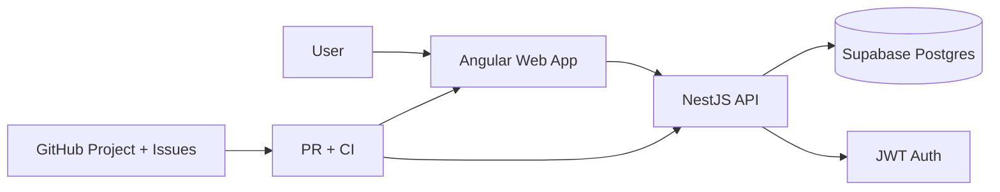
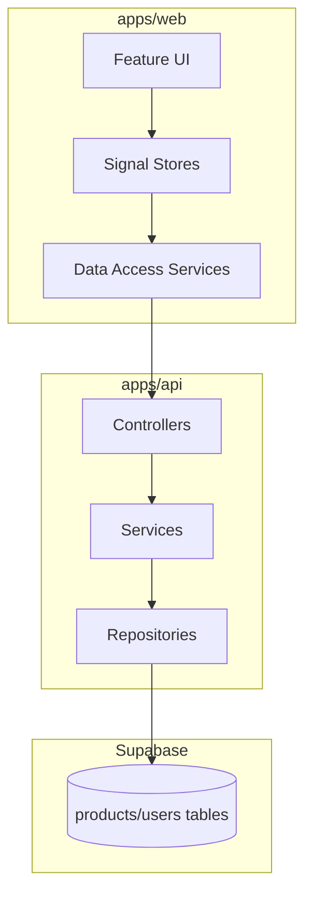

# System Architecture Overview

## Objective
Describe the MVP architecture and core boundaries for web, API, data, and delivery pipeline.

## Context diagram

## Component diagram

## Architectural rules
- Web follows feature-first structure: `domain`, `data-access`, `state`, `ui`.
- Web dependency direction: `ui -> state -> data-access -> core`.
- API follows NestJS module/controller/service boundaries.
- All delivery work is issue-first and PR-based with CI quality gates.

## Related docs
- `docs/adr/0001-architecture.md`
- `docs/ai/angular-ai-professional-playbook.md`
- `docs/runbooks/github-project-workflow.md`
- `docs/runbooks/local-dev.md`
